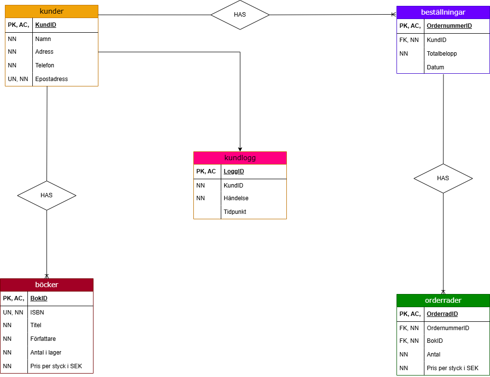

# Inlamning2 - Databaser YH2024 - Pontus Ydström
Detta repository innehåller alla mina filer för inlämningsuppgift 2 i kursen Databaser.

## Beskrivning
Denna databas är skapad för att hantera en liten bokhandel döpt till Yddesbokhandel. Den innehåller tabeller för:
- Böcker
- Kunder
 - Kundlogg
- Beställningar
- Orderrader

## Innehåll
- `inlamning2_pontus_yh2024.sql` - En SQL-fil med min exekverbara kod.
- `er-diagram_pontus_yh2024.drawio.png` - En bild av ER-diagrammet som visar databasens struktur.

## Analys och reflektioner

**Varför designade och strukturerade databasen och ER-diagrammet på just detta sättet?**
Jag har på grund av tidspress men också utifrån lärarens feedback på förra inlämningsuppgiften valt att utforma min databas utifrån de kunskaper jag samlat på mig under Databas-kursen. Jag tar inte ut svängarna jättemycket med en ny revolutionerande design utan  går på tidigare kunskaper och fokuserar mer på att förtydliga och finputsa kolumn-namn, främmande nycklar där det behövts.

Jag har till denna uppgiften gjort ett helt nytt ER-diagram med för denna uppgiften aktuella tabeller. Jag väljer också för att visa på bredd och förmåga, att använda ett tabellformat för diagrammet, något jag tycker blev visuellt snyggare.

**Vad jag skulle ändrat och gjort annorlunda utifrån perspektiven optimering och förändringar vid behov av skalbarhet?**

 - Jobbat mer med indexering för fler fält än bara e-postadress för att underlätta vid sökningar. Exempelvis ett index för KundID, eftersom att det kan vara en bra återkommande sökfråga att ha index för.

 - Jobbat med optimering av mina datatyper. Just nu är vissa datatyper för matematiska tal och strängar lite väl tilltagna och jag hade nog kunnat göra några av dem lite mer realistiska för att spara kostnad och minne.

 - Läst in mig mer på NoSQL och andra typer av SQL för att undersöka huruvida någon av dem hade varit lämpligare för mitt projekt. Just nu besitter jag för lite kunskap och tid för att kunna sätta mig in i det så pass djupt att jag kan ta ett säkert och genomtänkt beslut utan får använda det jag kan mest om och då är det MySQL. En snabb tanke är att jag eventuellt kunde ha använt NoSQL då vi i lektion 6 gick igenom att NoSQL är bra för att hantera stora datamängder med stor flexibilitet och skalbarhet.

## Instruktioner för användning
1. Öppna valfri MYSQL-klient.
2. Kör `inlamning2_pontus_yh2024.sql` för att skapa och fylla databasen.

